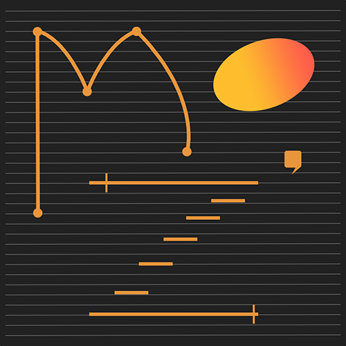

MOZ’Lib

==============

**MOZ’Lib** is a **Max** package dedicated to **computer-aided composition** (or CAC).
Its main purpose is to introduce the various problematics of CAC, programming and creation in general to young musicians from ages 9 to 99.
The library is made of several modules (or bpatchers) largely based on the [***bach***](http://www.bachproject.net) ecosystem created by **Andrea Agostini** and **Daniele Ghisi**. 
Each of these modules represents a compositional idea or technique, allowing the user to interact through various graphical interfaces.

**But that's just the tip of the iceberg !**
In addition to those main modules, MOZ’Lib includes a system called ***PWforMax***. Previously hidden in the background, *PWforMax* allows users to generate and run Lisp code in Max, and to work in real time with any library from the PatchWork / OpenMusic / PWGL family !

Developed since the beginning on macOS, MOZ'Lib and the *PWforMax* system it contains have been ported to Windows 10 in 2021 thanks to the invaluable help of [**Matteo Marson**](https://www.patreon.com/mmmt) and [**Juan Vassallo**](https://www.juanvassallo.com) :) 

MOZ’Lib is developed by composer [**Julien Vincenot**](http://julienvincenot.com), initially as a commission from the project *Ariane#*, directed by the DRAC (Regional Directorate of Cultural Affairs) of Franche-Comté region and piloted by the **Conservatory of Montbéliard**. The initial project was conceived in close interaction with composer and pedagogist [**Gaja Maffezzoli**](https://www.gajamaffezzoli.fr/bio/)
The current version, fully documented and translated into English since 2020, was part of Vincenot's doctoral research in composition at Harvard University, under the guidance of [**Hans Tutschku**](https://tutschku.com/).

Using this library requires to install [Cycling’74](http://cycling74.com)’s Max 7, 8 or 9 for Mac or Windows — it will work without a licence (Runtime mode) but you won’t be able to save new patches ! 

MOZ’Lib makes an extensive use of the [***bach***](http://www.bachproject.net) package, extended by the Common LISP language through [SBCL](http://sbcl.org) (Steel Bank Common LISP), which is distributed with MOZ’Lib under *GNU licence*.

MOZ’Lib will remain free and open-source, just like the many pieces of CAC software it relies on. However if you enjoy this project very much and would like to buy me a beer, a pizza or a ticket for an exuberant art show or the last blockbuster movie, you can leave me a tip [here](https://paypal.me/julienvincenot).

You can also contact me directly if you are interested to organize private lessons or collective courses on CAC with bach and MOZ'Lib.

-----

# How to install MOZ'Lib :

***ATTENTION:
before installing/updating, make sure you don't have any past version of MOZ'Lib on your machine !***

1) [Download](https://cycling74.com/downloads/) and install the latest version of Max (ideally 8 or 9 but 7 works too) for Mac or PC

2) Now start Max and install the last version of the *bach*, *cage*, *dada* and *ears* packages
   from Max’s Package Manager (File menu in Max) or more recent versions from [*bach*’s official Patreon](https://www.patreon.com/bachproject). 
   
   The minimum recommended version is bach 0.8.1, released in the fall 2019.
   
   If downloaded from the Patreon, make sure to place the decompressed folders of bach / cage / dada / ears into Max’s Packages folder.
   
   on Mac : *your_user_folder/Documents/Max 8/Packages/* 
              (or equivalent for Max 7 or 9)
   
   on PC : C:\Windows\Users\your_name\Documents\Max8\Packages\
            &emsp;&emsp;&emsp;or
           C:\Windows\Users\your_name\OneDrive\Documents\Max8\Packages\
              (or equivalent for Max 7 or 9)

3) Download the latest version of MOZ'Lib available on the [**releases**](https://github.com/JulienVincenot/MOZLib/releases).

   NOTE : Following some big change in the structuration of this Github on June 2025, it is recommended NOT to download via the green "Code" and "Download ZIP" anymore. The correct way from now on is using the releases, which also have a consistent version number !

# **macOS install**

4) Simply copy the decompressed folder of MOZ’Lib in the Packages folder as well.

   Again that is, on Mac : *your_user_folder/Documents/Max 8/Packages/* 
                        (or equivalent for Max 7 or 9)

   No more action is needed, install process has been simplified since June 2025 !

  &emsp;&emsp;&emsp;***IMPORTANT:***  &emsp;&emsp;&emsp;**If your system is macOS 10.13 or later** it is possible that your Documents folder is actually located on iCloud Drive... ***PWforMax* will not work in these conditions !**
  You will need either to disable iCloud Drive (at least for Documents and Desktop) or create a dummy Documents folder in your user folder (home), with the following directory structure :
  &emsp; *your_user_folder/Documents/Max 8/Packages/* (or equivalent for Max 7 or 9)
  &emsp; (you still put MOZLib in Packages obviously)

  &emsp;&emsp;&emsp;***VERY IMPORTANT:***  &emsp;&emsp;&emsp;**If your computer runs macOS 10.15 (Catalina) or above**, 
  MOZ'Lib will not be able to work in Max unless you remove it from the system quarantine by entering the following command in the terminal :
  &emsp; ***xattr -rd com.apple.quarantine ~/Documents/Max\ 8/Packages/*** *
  &emsp;(substitute 8 with 7 or 9 depending which version you use — and don't forget the * symbol !)
  This operation is mandatory to use any package not distributed on Cycling'74's Package Manager.
  
  
5) Restart Max and go to **Extras menu -> MOZ'Lib -> PWforMax LISP Test** to check everything went well.  
 

# **Windows 10 or 11 install**

4) Install on Windows is slightly more complicated but following this separate [install instructions pdf](https://github.com/JulienVincenot/MOZLib/raw/master/forWindows/MOZLib_Windows_Instructions.pdf) very carefully will ensure that everything works, including PWforMax and ~99% of Lisp-based functionalities.

&emsp;&emsp;&emsp;***The whole install can take time, be patient it's a one time thing !*** **;)**

Unlike previous attempts to build a full installer for Windows user, tests on multiple machines and setups proved this project completely out of our reach. This is why we prefer now to ask users to be responsible for their own install of **WSL - Windows subsystem for Linux)** and SBCL. This way, installing future updates of MOZ'lib will also require a minimal effort !

&emsp;&emsp;&emsp;***VERY IMPORTANT:*** At some point in the procedure you will need to choose a username and password for WSL. Keep those preciously, you will need them later to compile and install SBCL as well as some other small install actions.

5) After following the pdf to the very last page carefully, restart Max and go to **Extras menu -> MOZ'Lib -> PWforMax LISP Test** to check everything went well.  

\
\
\
**...and finally**

6) Go to the *MOZ’Lib Intro* patch in the Extras menu and… **HAVE FUN !**

-----

# Dependencies:

MOZ'Lib includes the following open-source software :
- [shell](https://github.com/jeremybernstein/shell) object for Max by Jeremy Bernstein and Bill Orcutt
- [SBCL](http://www.sbcl.org) (Steel Bank Common Lisp), an open source Common Lisp compiler 
  Note: MOZ'Lib contains an executable of SBCL 2.5.5 pre-compiled for macOS. New versions will be compiled when needed. In June 2025, this version is compatible with macOS Mojave and onwards, on both Intel and Silicon machines.
- the ***moz-complete.core*** used for *PWforMax* contains a modified version of several Lisp functions from **Ircam's** ***OpenMusic*** sources (based on ***PatchWork***), as well as user libraries written for either *PatchWork*, *OpenMusic* or *PWGL* by **Mikael Laurson** (*PWConstraints* a.k.a. *OMCS*), **Kilian Sprotte** (*OMPW*, *OMPW-utils* and *SMC*), **Örjan Sandred** (*Cluster-Engine*), **Jean-Baptiste Barrière** (*Chréode*), **Kaija Saariaho** (*Transkaija*), **Jacopo Baboni Schilingi** (*JBS-CMI*, *JBS-Profile* and *JBS-Constraints*), **Torsten Anders** (*Cluster-Rules*), and **Frederic Voisin** (*Morphologie*). The core also contains the [*ITERATE*](https://common-lisp.net/project/iterate/) library by **Jonathan Amsterdam** and **Andrea Fuchs** and a modified version of Guy Steele's [*BACKQUOTE*](https://www.cs.cmu.edu/Groups/AI/html/cltl/clm/node367.html) implementation in Common Lisp. Other Lisp library dependencies have been added temporarily to support some ongoing development, like *Alexandria*, *Lparallel*, *Screamer*, *Split-Sequence* or **Guillaume Le Vaillant**'s *Simple-Neural-Network*, see the sources folder to see the entire list.

**Note:** All those are available in the sources subfolder, allowing users to recompile the core and add other libraries if they wish. See the new "PWforMax User-libraries" feature under Extras to know more.
